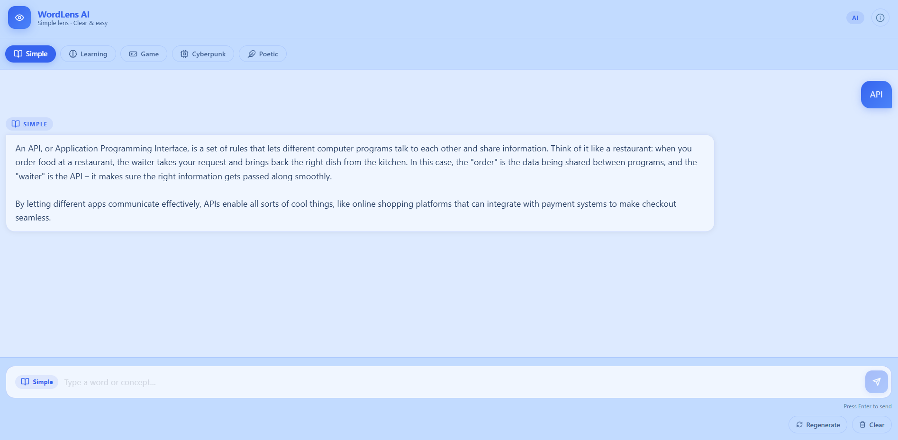
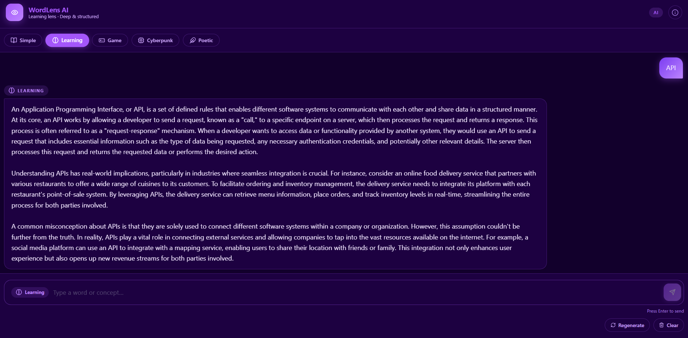
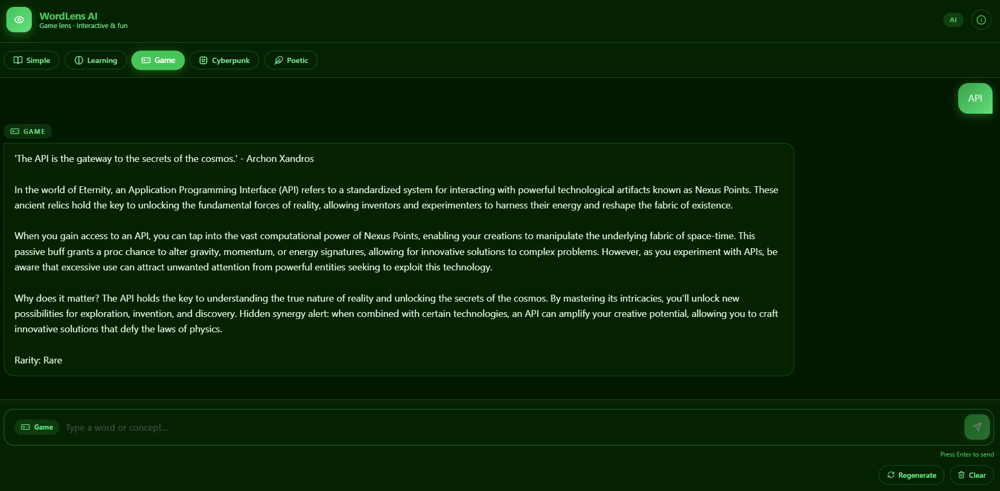
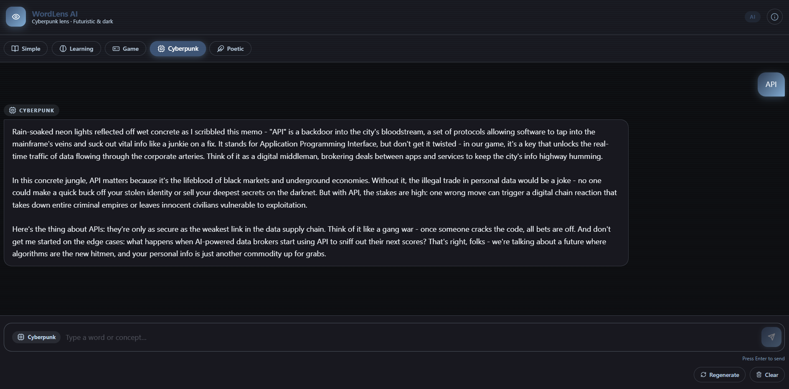
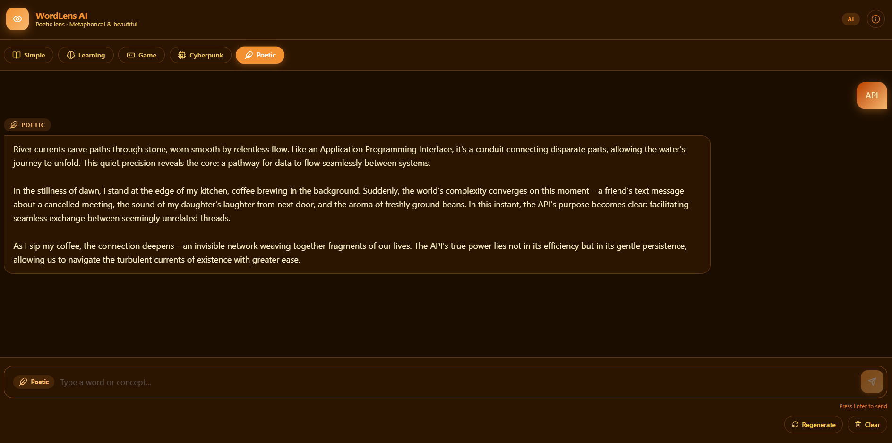

# WordLens AI

Explain any word or concept through five AI-powered lenses, each with its own visual theme. Built entirely in Rust — Leptos/WASM frontend, Axum backend, Llama 3 via Ollama.

---

## Themes

<table>
  <tr>
    <td align="center"><br/><b>Simple</b></td>
    <td align="center"><br/><b>Learning</b></td>
    <td align="center"><br/><b>Game</b></td>
    <td align="center"><br/><b>Cyberpunk</b></td>
    <td align="center"><br/><b>Poetic</b></td>
  </tr>
</table>

---

## Lenses

| Lens | Theme | Style |
|------|-------|-------|
| **Simple** | Soft blue | Clear, no jargon |
| **Learning** | Deep purple | Structured with examples |
| **Game** | Neon green | Reframed as a game mechanic |
| **Cyberpunk** | Dark + steel blue | Tech-noir, atmospheric |
| **Poetic** | Warm amber | Metaphorical prose |

---

## Tech Stack

| Layer | Technology |
|-------|-----------|
| Frontend | Leptos 0.7 (Rust → WASM, CSR) |
| Build | Trunk |
| Styling | Tailwind CSS (CDN) + CSS custom properties |
| Backend | Axum (Rust) |
| Cache | Moka (async in-memory, 1 h TTL) |
| AI Runtime | Ollama |
| Model | Llama 3 (`llama3`) |

---

## Architecture

```
Browser
  │  POST /api/explain  { word, lens, stream }
  ▼
Leptos WASM  :8080  (Trunk dev proxy)
  │
  ▼
Axum API     :3001  (Moka cache → cache hit returns immediately)
  │
  ▼
Ollama       :11434
  │
  ▼
token stream → SSE → Leptos reactive UI
```

---

## Getting Started

### Prerequisites

| Tool | Install |
|------|---------|
| Rust + Cargo | https://rustup.rs |
| `wasm32-unknown-unknown` | `rustup target add wasm32-unknown-unknown` |
| Trunk | `cargo install trunk` |
| Ollama | https://ollama.com |

### 1. Pull the model

```bash
ollama pull llama3
```

### 2. Start Ollama

```bash
ollama serve
```

### 3. Start the backend

```bash
cd backend && cargo run --release
```

### 4. Start the frontend

```bash
cd frontend && trunk serve
```

Open **http://localhost:8080**.

---

## Production Build

```bash
cd frontend && trunk build --release
cd ../backend && cargo run --release
```

The backend serves `../frontend/dist` as static files. Override with `FRONTEND_DIST`.

---

## Project Structure

```
wordlens-ai/
├── backend/
│   └── src/
│       ├── main.rs      # Axum server, Moka cache, /api/explain, /api/history
│       ├── history.rs   # In-memory ring buffer (last 50 explanations)
│       └── prompts.rs   # Prompt templates per lens
└── frontend/
    ├── Trunk.toml       # Build config + dev proxy
    ├── index.html       # Entry point — Tailwind CDN, CSS variables, keyframes
    └── src/
        └── main.rs      # Leptos app: components, SSE streaming, state
```

---

## API

### `POST /api/explain`

```json
{ "word": "entropy", "lens": "cyberpunk", "stream": false }
```

`lens`: `simple` | `learning` | `game` | `cyberpunk` | `poetic`

**Non-streaming response:**
```json
{ "explanation": "...", "lens": "cyberpunk", "word": "entropy", "cached": false }
```

**Streaming response:** Server-Sent Events, one token per `data` event. Final `event: done` signals completion. Streamed responses are not cached.

---

### `GET /api/history?limit=20`

Returns the last N explanations (max 50), most recent first.

```json
[{ "word": "entropy", "lens": "cyberpunk", "snippet": "...", "timestamp": 1744000000 }]
```

---

### `GET /health`

```json
{ "status": "ok" }
```

---

## Environment Variables

| Variable | Default | Description |
|----------|---------|-------------|
| `BIND_ADDR` | `0.0.0.0:3001` | Backend listen address |
| `OLLAMA_URL` | `http://127.0.0.1:11434` | Ollama base URL |
| `OLLAMA_MODEL` | `llama3` | Model passed to Ollama |
| `FRONTEND_DIST` | `../frontend/dist` | Path to compiled frontend assets |
